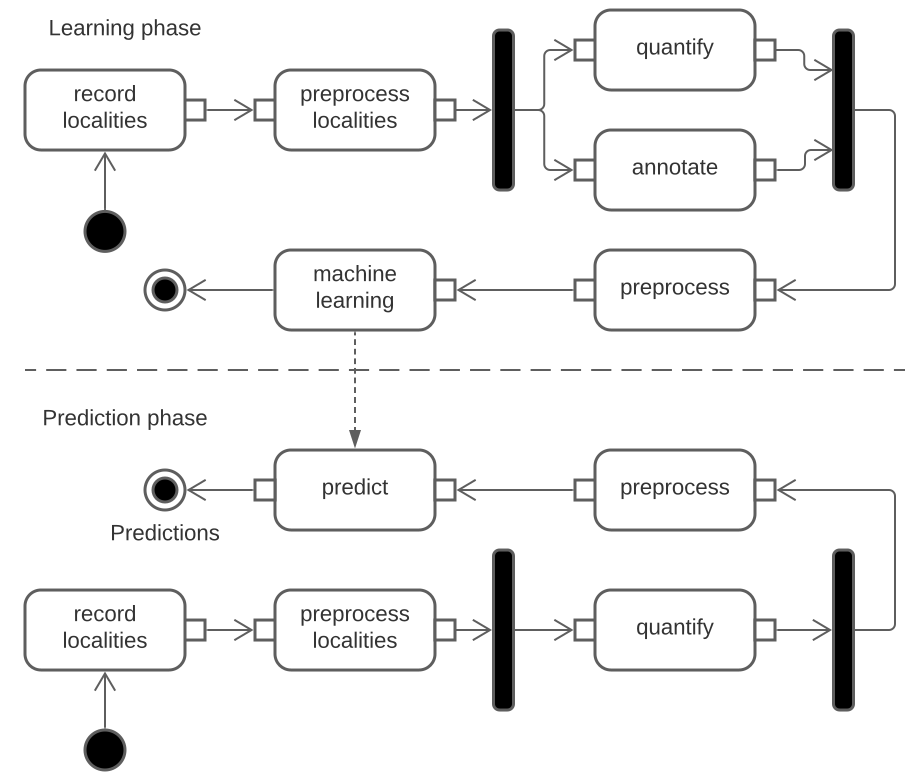

- [Description](#description)
- [Pre](#pre)
- [Configuration](#configuration)
- [Running](#running)
- [Machine Learning](#machine-learning)
- [Concept](#concept)
  * [Record localities](#record-localities)
  * [Preprocess localities](#preprocess-localities)
  * [Quantify localities](#quantify-localities)
  * [Annotate localities](#annotate-localities)
  * [Preprocess quantified and annotated localities](#preprocess-quantified-and-annotated-localities)

<!-- <small><i><a href='http://ecotrust-canada.github.io/markdown-toc/'>Table of contents generated with markdown-toc</a></i></small> -->

# Description
This is a MonoRepository which aims to automatically find bugs in source code  
based on software-metrics.

This package contains all programs needed to run to generate a learning dataset.  
It uses partial implementations of the bugFinder-framework which are placed in  
the packages directory. You can find these packages on npm, too.   

This package uses [bugFinder-framework](https://github.com/penguinsAreFunny/bugFinder-framework)
and implementation-packages of bugFinder-framework-interfaces.

# Pre
```
git submodule update --init --recursive  
npm install  
```
You won´t need SonarQube, if you do not like to quantify with SonarQubeQuantifier  

Used Versions
```
git v2.33.1
SonarQube v9.0.1.46107  
node v14.17.0
Anaconda3 2020.07 (Python 3.8.3 64-bit)
```
# Configuration
Each script has a configuration file.  
See src/.../module_name/inversify.config.ts

# Running
Please consider [configuring](#Configuration) the scripts before running.  
You can run the scripts:
```
npm run recording-01a-localityRecording
npm run recording-01b-localityPreprocessing
npm run recording-02a-quantifying
npm run recording-02b-annotating
npm run preprocessing
npm run training
```

# Machine Learning
The training phase is not automated. You can use packages/bugFinder-machineLearning as a template.  
For further readings see [bugFinder-machineLearning](#https://github.com/penguinsAreFunny/bugFinder-machineLearning)

# Concept
The whole process of finding bugs in source code with machine learning is modeled as a pipeline:  
  

## Record localities
Record localities you want to find bugs in. F.e. a Commit or a path in a commit.
## Preprocess localities
Preprocess the recorded localities. You might want to filter localities you do not want to consider for now or inject localities.
## Quantify localities
You need to quantify your preprocessed localities with the goal of generating features used for machine learning.
F.e. measure software-metrics about the last changes of your source-code file.
## Annotate localities
You need to annotate you localities to generate able to generate a suitable dataset for supervised learning.  
Do the localities contain a bug or do the not? 
F.e. Take the next five changes of a file into account and measure how many bug fixes were made.
## Preprocess quantified and annotated localities
With the goal of achieving a dataset, which can be easily used with [scikit-learn](#https://scikit-learn.org/stable/) your
quantified and annotated localities need to be transformed to a suitable format. You might want to filter features or samples you do not want to consider.